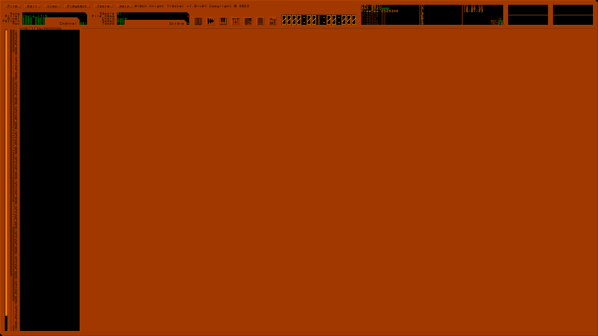
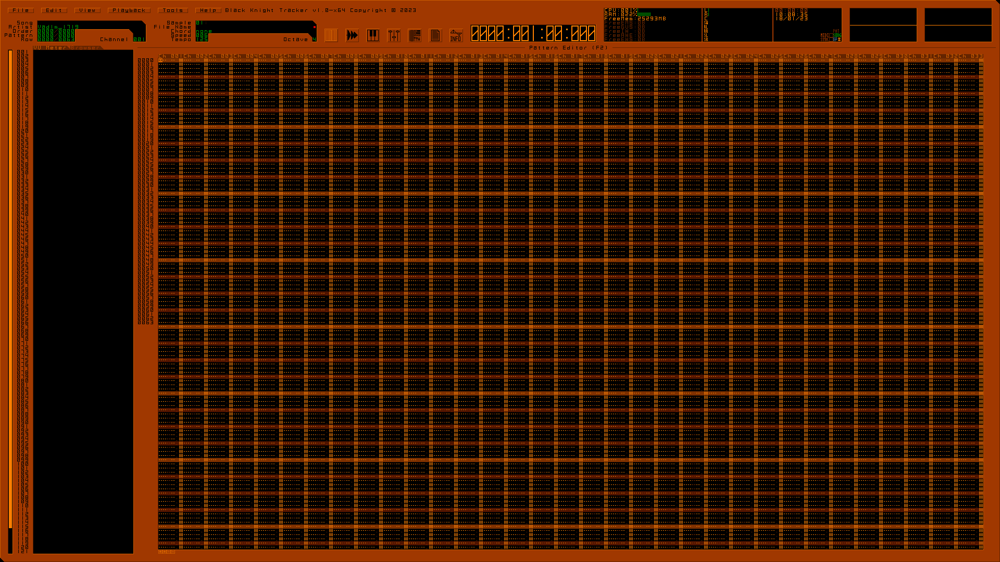
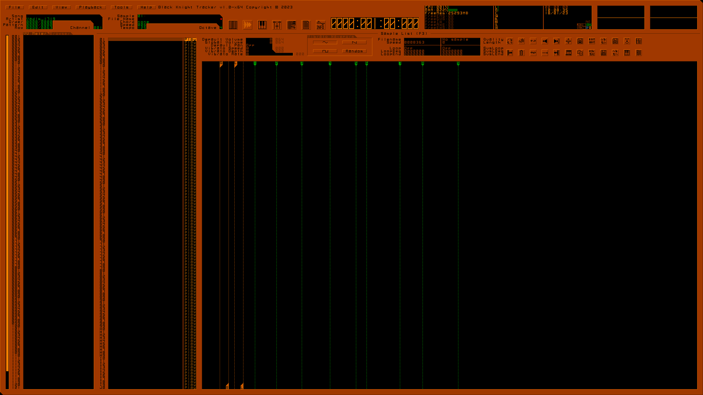
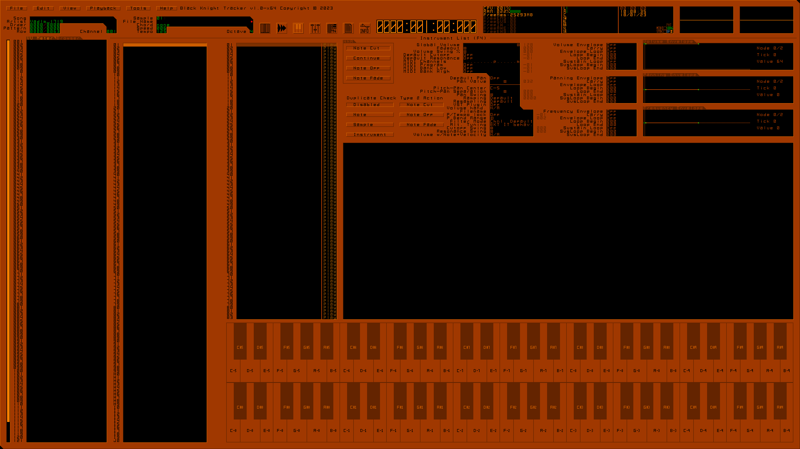
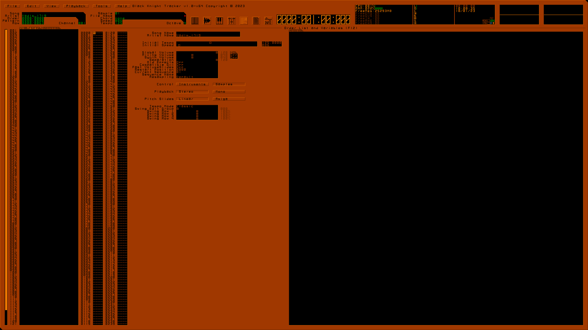
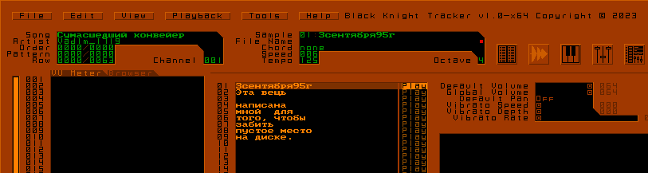

# Text Mode GUI Layouts
## Main layout

- Panel mostly like Scream Tracker 3 style
- Buttons for mobile performance (If don't have keyboard)
- Time Panel from DAW (Digital Audio Workstation) 
- Customizable GUI
- Stereo Scopes from IMAGO Orpheus(Also clickable to change visualization example 8 Channel (7.1) VU meter, Mono Scope, 4 Channel (Surround, Quadraphonic) Scopes, 6 Channel (5.1) Scopes, 8 Channel (7.1) Scopes, Spectrum from Schism Tracker, Stereo Spectrum from Schism Tracker, Spectrum from IMAGO Orpheus, Stereo Spectrum from IMAGO Orpheus, Spectrogram, Stereo Spectrogram, None(Off), Memory Stats) it total 14 different visualizations
- VU Meter and Browser in the tab
- Menu buttons

## Pages
### Pattern Editor

- 4 digits row
- 4th track view (Ctrl-Shift-3) maximum 33 channels
- ▒ The Pattern Track View confortable by me ▒
### Sample List

- Buttons from hot key shortcuts in the help
- Click and Drag Loop, Sustain Loop and Cues with `Ix` (OpenMPT `o0x`)
### Instrument List

- Keyboard can be played in left mouse button, to edit splits right mouse button
- Advanced controls with waveform view, sample list, all envelopes in single page
### Channel Mixer

- Added Chorus and Reverb volume
- This page available all sliders to confortable not pressing F11 twice
- Added 4OP for OPL3 Synthesis
### Order List & Variables

- MPTM factorial tempo
- Added fast volume slides [S3M Behaviour] (BKM adds)
- Order List moved from F11 to F12 and added 2nd row
- Picture Cover

## Special
### Russian text in BKT

- Font has been found from DVD bootloader※1. Copyright © TEAM LTD 

```
※1 Using Impulse Tracker font customizer via REAL HARDWARE. You can load the BIOS font pressing Ctrl-BackSpace and save .ITF
```